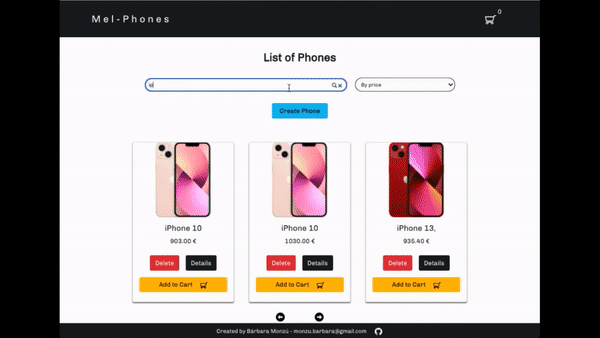

# Soamee-test

#### App demo: https://mel-phones.herokuapp.com/
Catalog not available yet.
Error 503 server. I'm working in it :)



<br>

### Description

**Mel-Phones** (SPA) 
It is a simulation of a mobile store. The user can browse web pages, filter by name and price, create, edit and delete phones as well as select products for later purchase. You can also see opinions of other users and create your own.


**Mel-Phones** (SPA) 
Es una simulación de una tienda de móbiles. El usuario puede navegar por las páginas web, filtrar por nombre y precio, crear, editar y eliminar teléfonos así como seleccionar productos para su posterior compra. También puede ver opiniones de otros usuarios y crear las suyas propias.


### Server Install

```sh
npm install
```

### Server Usage

```sh
npm run dev
```


### Server .env variables needed

- PORT=5005
- ORIGIN=http://localhost:3000
- MONGODB_URI
- CLOUDINARY_NAME = Your Cloudinary user name
- CLOUDINARY_KEY = Key to your Cloudinary account
- CLOUDINARY_SECRET = Secret key of your Cloudinary account

### Server DDBB

You can add the ***phones.json*** file that you will find in the ***seeds*** folder to your database to have the catalog.

Puedes agregar el archivo ***phones.json*** que encontrarás en la carpeta ***seeds*** a tu base de datos para tener el catálogo


### Client Install

```sh
npm install
```

### Client Usage

```sh
npm run start
```

### Client .env variables needed:

- REACT_APP_BASE_URL=http://localhost:5005


### Endpoints

|	Method	|	Path	|	Description	|
|	-	|	-	|	-	|
|	GET	|	/phones	|		Brings all phones |
|	GET	|	/phones/details/:id	|		Bring one phone |
|	POST	|	/phones	|	Create a phone |
|	PUT	|	/phones	|		Edit a phone |
|	DELETE	|	/phones	|	Delete a phone	|
|	POST	|	/uploads	|	Upload an image |
|	GET	|	/reviews/:id	|		Bring the reviews of a phone |
|	POST	|	/reviews/:id	|	Create a review |


### Front-end Endpoints

| Routes file | Path                       | Action                                            | 
| ----------- | -------------------------- |-------------------------------------------------- |
| User 
|             | /                  | Render all phones                  |
|             | /details/:id                    | Details of a phone |
|             | /cart           | Shopping Cart|


### Technologies

- React - Hooks
- MongoDB
- Express
- Node.js
- Javascript (ES6)
- HTML & CSS
- Bootstrap

### Aditional Info

Project developed in two days.

